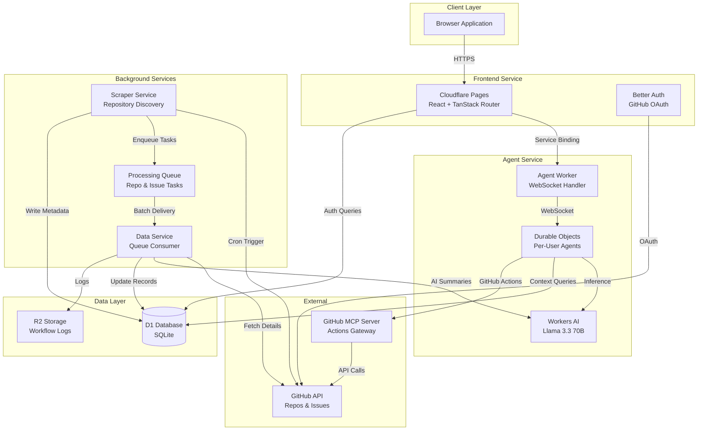

# Contribot

An AI-powered platform designed to help new developers discover and contribute to beginner-friendly open-source projects. Contribot combines intelligent issue discovery, personalized recommendations, and conversational AI assistance to streamline the journey from exploration to first pull request.

**Deployed Link:** https://contribot.net
**Setup Instructions:** See [SETUP.md](./SETUP.md)
**Video Demo:** Coming soon

## Overview

Contribot operates as a fully integrated Cloudflare-native application that continuously monitors GitHub for good first issues, generates AI-powered summaries and difficulty assessments, and provides users with a chat-driven interface to guide them through their first contributions.

The platform features a split-view interface with persistent chat on the left and a dynamic dashboard on the right. Users interact primarily through natural conversation with an AI agent that can suggest repositories, explain issues, and execute GitHub actions with confirmation.

## Key Features

### Intelligent Discovery

-   **Automated Repository Scanning**: Background workers discover beginner-friendly repositories from curated sources and GitHub labels
-   **Continuous Issue Tracking**: Scheduled scraping runs twice daily to maintain fresh issue data
-   **Hash-Based Change Detection**: Only updates database records when meaningful metadata changes, minimizing unnecessary processing

### AI-Powered Analysis

-   **Repository Summaries**: One-paragraph overviews generated using Workers AI (Llama 3.3 70B)
-   **Issue Introductions**: Concise 2-3 sentence explanations of each issue's context
-   **Difficulty Scoring**: Automated 1-5 difficulty ratings based on issue complexity
-   **First Steps Guidance**: AI-generated suggestions for approaching each issue

### Conversational Interface

-   **Real-Time Chat**: WebSocket-based communication with sub-50ms latency
-   **Stateful Agents**: Per-user Durable Objects maintain conversation context and history
-   **Natural Language Actions**: Execute GitHub operations through conversational requests
-   **Confirmation Flows**: Safety-first approach requiring explicit approval for all write operations

### Personalized Experience

-   **Language Preferences**: Filter recommendations by programming language
-   **Difficulty Matching**: Issues matched to user's skill level
-   **GitHub Integration**: One-click repository scanning to auto-detect language experience
-   **Onboarding Flow**: Guided setup capturing preferences and skill level

### GitHub Actions

-   **Repository Forking**: Fork repos directly from chat or dashboard
-   **Branch Creation**: Automated branch setup with naming conventions
-   **Issue Commenting**: Draft and post comments with preview
-   **Pull Request Creation**: Streamlined PR submission workflow

## Getting Started

### Onboarding Flow

When you first access Contribot, you'll go through a quick onboarding process to personalize your experience:

1. **GitHub Authentication**: Sign in with your GitHub account to enable repository actions
2. **Language Selection**: Choose programming languages you're interested in (or scan your GitHub profile to auto-detect)
3. **Difficulty Preference**: Set your skill level (1-5) to match you with appropriate issues
4. **Preferences Saved**: Your settings are stored and can be updated anytime in the Settings tab

The entire onboarding takes under 60 seconds and can be skipped to explore with default settings.

### Example Usage Flow

Here's a typical journey from discovering an issue to making your first contribution:

#### 1. **Discovering Issues**

Start a conversation with the AI agent:

```
You: "Show me some beginner-friendly TypeScript issues"
```

The agent suggests relevant issues and updates the dashboard with results. Each issue includes:

-   A difficulty rating (score out of 5)
-   An AI-generated introduction explaining the context
-   Suggested first steps to get started
-   Links to the repository and issue

#### 2. **Exploring an Issue**

Click on an issue in the dashboard or ask the agent for details:

```
You: "Tell me more about the React type inference issue"
```

The agent provides:

-   A breakdown of what needs to be fixed
-   Technical context about the codebase
-   Recommendations for your skill level
-   Next steps to begin working on it

#### 3. **Setting Up Your Workspace**

Request GitHub actions through natural conversation:

```
You: "Fork this repository and create a branch for me"
```

The agent asks for confirmation, showing exactly what will happen:

-   Repository will be forked to your account
-   New branch created with suggested name
-   Instructions for cloning locally

After you confirm, the agent executes the actions and provides next steps.

#### 4. **Working on the Issue**

Make your changes locally, then use the agent to manage the contribution process:

```
You: "I've pushed my changes. Help me comment on the issue and create a PR"
```

The agent guides you through:

-   Drafting a comment explaining your approach
-   Creating a pull request with appropriate description
-   Following the repository's contribution guidelines

#### 5. **Tracking Your Progress**

Throughout the process:

-   The dashboard updates in real-time as you take actions
-   Favorite issues and repos to track them in the Favourites tab
-   Return to previous conversations - the agent remembers your context
-   Switch between multiple issues without losing progress

### Navigation

The interface is split into two persistent sections:

-   **Left Panel (Chat)**: Conversational AI that remembers context and executes actions
-   **Right Panel (Dashboard)**: Visual interface with tabs for:
    -   **Overview**: Your contribution stats and quick actions
    -   **Repos**: Recommended repositories with good first issues
    -   **Issues**: Searchable, filterable issue list
    -   **Favourites**: Your saved issues and repositories
    -   **Settings**: Update language preferences and difficulty

You can use either panel independently or combine them - ask the agent to find issues, then explore details in the dashboard, or browse the dashboard and ask the agent questions about specific items.

## Architecture

The application is built on a microservices architecture running entirely on Cloudflare's edge platform, with each service optimized for its specific workload.



### Service Architecture

#### User Application (Cloudflare Pages)

The frontend is a React single-page application built with TanStack Router and deployed to Cloudflare Pages. It handles:

-   User authentication via Better Auth with GitHub OAuth
-   Split-view interface (chat + dashboard)
-   Onboarding flow for preference collection
-   API routes that proxy to agent service via service binding

**Key Technologies**: React 19, TanStack Router, shadcn/ui, Tailwind CSS, Better Auth

#### Agent Service (Cloudflare Workers + Durable Objects)

A dedicated Worker service that manages per-user AI agents using Cloudflare's Agents SDK. Each user gets a persistent Durable Object instance that maintains:

-   Conversation history with automatic summarization after 20 messages
-   Dashboard state synchronization
-   Pending action confirmations
-   Scheduled task management

The agent uses Workers AI for natural language understanding and response generation, interfacing with GitHub through a remote MCP server for repository operations.

**Key Technologies**: Cloudflare Agents SDK, Durable Objects, Workers AI, Hono

#### Data Service (Cloudflare Workers)

A queue consumer service responsible for processing repositories and issues discovered by the scraper. It:

-   Fetches detailed repository metadata from GitHub
-   Generates AI summaries and difficulty scores
-   Processes issues in batches
-   Manages processing state and retry logic

**Key Technologies**: Queue Consumers, Workers AI, Drizzle ORM

#### Scraper Service (Cloudflare Workers)

A scheduled worker that runs every 12 hours to discover repositories and issues. It operates in a lightweight discovery mode:

-   Fetches repository lists from curated sources (awesome-for-beginners)
-   Queries GitHub API for basic metadata
-   Computes metadata hashes for change detection
-   Enqueues changed repositories for full processing

**Key Technologies**: Cron Triggers, GitHub REST API

### Data Flow

**Repository Discovery Flow**

1. Cron triggers scraper service every 12 hours
2. Scraper fetches repos from curated sources
3. For each repo, scraper queries GitHub for open issues count
4. Metadata hash computed and compared to existing database record
5. New or changed repos enqueued to processing queue
6. Data service consumes queue, fetches full details, generates AI summary
7. Issues extracted and individually enqueued for processing
8. Each issue processed separately with AI analysis

**User Interaction Flow**

1. User sends message via WebSocket to their agent
2. Agent builds context from user preferences and conversation history
3. Agent calls Workers AI with enriched prompt
4. Response parsed for intent and suggested actions
5. Write actions require confirmation via multi-step conversation
6. Upon confirmation, agent calls GitHub MCP server with user's tokens
7. Results returned to user and dashboard state updated
8. State changes pushed to client via WebSocket

## Cloudflare Services Used

### Workers

-   **Agent Service**: WebSocket handler and agent orchestration
-   **Data Service**: Queue consumer for background processing
-   **Scraper Service**: Scheduled repository discovery
-   **User Application SSR**: Server-side rendering and API routes

### Durable Objects

-   **Per-User Agents**: Stateful conversation management with persistent storage
-   **Global Uniqueness**: One Durable Object instance per user, identified by user ID
-   **WebSocket Hibernation**: Efficient connection management with automatic state restoration

### Workers AI

-   **Model**: Llama 3.3 70B Instruct
-   **Use Cases**:
    -   Repository summaries
    -   Issue introductions and difficulty scoring
    -   Conversational responses
    -   Natural language parsing
-   **Token Management**: Context limited to 10 most recent messages plus summary

### D1 Database

-   **Schema**: Drizzle ORM with type-safe queries
-   **Tables**: Users (auth), repositories, issues, AI summaries, favourites
-   **Access Pattern**: Edge reads for user queries, batch writes from queue consumers

### Queues

-   **Processing Queue**: Decouples discovery from expensive processing
-   **Dead Letter Queue**: Failed tasks automatically routed for investigation
-   **Batching**: Up to 10 messages processed per invocation

### R2 Storage

-   **Workflow Logs**: Long-term storage of processing logs and metrics
-   **Access**: Append-only writes from data and scraper services

### AI Gateway

-   **GitHub MCP Server**: Remote Model Context Protocol server for GitHub operations
-   **Endpoint**: `https://api.githubcopilot.com/mcp/`
-   **Authentication**: User's GitHub OAuth token passed per request

### Pages

-   **Frontend Deployment**: React application with automatic builds
-   **Environment**: Node.js compatibility for server-side rendering

## Technology Stack

### Frontend

-   **React 19**: UI framework with functional components and hooks
-   **TanStack Router**: Type-safe file-based routing
-   **shadcn/ui**: Accessible component library
-   **Tailwind CSS**: Utility-first styling with semantic tokens
-   **TanStack Query**: Server state management and caching

### Backend

-   **Hono**: Lightweight web framework for Workers
-   **Drizzle ORM**: Type-safe database queries
-   **Better Auth**: Authentication with GitHub OAuth provider
-   **Cloudflare Agents SDK**: Agentic behavior framework

### Development

-   **TypeScript**: Strict mode enabled, no any types
-   **Biome**: Code formatting and linting
-   **pnpm**: Fast, efficient package management
-   **Monorepo**: Workspace-based project structure

## Project Structure

```
contribot/
├── apps/
│   ├── agent-service/          # AI agent with WebSocket support
│   │   ├── src/
│   │   │   ├── durable-objects/
│   │   │   │   └── agent.ts    # ContribotAgent implementation
│   │   │   ├── api/
│   │   │   │   └── github-client.ts  # GitHub MCP client
│   │   │   └── index.ts        # WebSocket handler
│   │   └── wrangler.jsonc      # Worker configuration
│   │
│   ├── data-service/           # Background processing
│   │   ├── src/
│   │   │   ├── ai/             # AI summarization
│   │   │   ├── processor/      # Repo & issue handlers
│   │   │   └── index.ts        # Queue consumer
│   │   └── wrangler.jsonc
│   │
│   ├── scraper-service/        # Scheduled discovery
│   │   ├── src/
│   │   │   ├── discovery/      # Repo discovery logic
│   │   │   └── index.ts        # Cron handler
│   │   └── wrangler.jsonc
│   │
│   └── user-application/       # Frontend application
│       ├── src/
│       │   ├── components/     # React components
│       │   │   ├── chat/       # Chat interface
│       │   │   └── dashboard/  # Dashboard views
│       │   ├── routes/         # File-based routing
│       │   └── lib/            # Utilities
│       └── wrangler.jsonc
│
├── packages/
│   ├── data-ops/               # Shared database package
│   │   ├── src/
│   │   │   ├── drizzle/        # Schema definitions
│   │   │   ├── queries/        # Reusable queries
│   │   │   └── auth/           # Better Auth setup
│   │   └── drizzle.config.ts
│   │
│   └── r2-logger/              # Workflow logging utility
│       └── src/
│           └── r2-logger.ts
│
├── docs/                       # Project documentation
└── package.json                # Root workspace config
```

## Performance Characteristics

### Latency

-   **WebSocket Connection**: ~50ms edge connection establishment
-   **Chat Response**: 200-800ms including AI inference
-   **Dashboard Queries**: 20-50ms from edge D1 replicas
-   **State Synchronization**: Real-time push updates (no polling)

### Scalability

-   **Concurrent Users**: Millions (Durable Objects auto-scaling)
-   **Cold Start**: ~100ms for Durable Objects, ~10ms warm invocations
-   **Geographic Distribution**: Global edge deployment with routing to nearest datacenter
-   **Database**: D1 automatic replication to edge locations

### Cost Efficiency

-   **Workers**: Free tier covers 100k requests/day
-   **Durable Objects**: ~$5/month for 100 active users
-   **Workers AI**: ~$30/month for 3M tokens (100 users × 10 chats/day)
-   **D1**: Free tier covers 100k reads, 10k writes/day
-   **Estimated**: $35-40/month for 100 active daily users

## Security

### Authentication

-   GitHub OAuth with extended scopes (repo, workflow, read:user)
-   Session management via Better Auth
-   Tokens encrypted at rest in D1

### Authorization

-   Per-user agent isolation via Durable Objects
-   Service bindings prevent external agent access
-   API routes validate session before proxying to agent

### Data Protection

-   GitHub tokens never exposed to frontend
-   User data partitioned by user ID
-   CORS configured for dashboard origin only

### Rate Limiting

-   GitHub API: 5,000 requests/hour (authenticated)
-   Workers AI: Account-level quotas enforced
-   Agent aware of rate limits, informs user on exhaustion

## Development Principles

### Type Safety

-   TypeScript strict mode across all packages
-   No any types permitted
-   Drizzle provides compile-time query validation
-   TanStack Router ensures type-safe navigation

### Code Style

-   camelCase for variables and functions
-   PascalCase for React components and classes
-   snake_case for database field names
-   Biome for consistent formatting

### Architecture Patterns

-   Service bindings for inter-worker communication
-   Queue-based decoupling of discovery and processing
-   Idempotent operations with hash-based change detection
-   Confirmation flows for all destructive actions

### User Experience

-   Chat-first interface with full UI parity
-   Markdown formatting in agent responses
-   Optimistic updates with rollback on failure
-   Clear error messages with recovery suggestions

## Current Limitations

### Voice AI

Stub implementation present. UI shows microphone button, but voice processing awaits full Cloudflare Realtime Agents API availability.

### Resume Upload

Onboarding includes placeholder for resume OCR. Language detection currently manual or via GitHub scan.

### Conversation History

Limited to 20 messages before automatic summarization. Full history storage in D1 not yet implemented.

### Rate Limit Handling

Agent informs user when limits reached but does not implement automatic retry with backoff.

## Contributing

This project follows strict coding standards:

-   All database operations via Drizzle
-   No raw SQL queries
-   Frontend uses shadcn/ui components exclusively
-   Tailwind semantic color tokens (no hardcoded colors)
-   Comments only for complex logic, not obvious code

## License

See LICENSE file for details.

## Documentation

-   `SETUP.md` - Local development and deployment setup
-   `docs/OVERVIEW.md` - Product vision and principles
-   `docs/IMPLEMENTATION.md` - Detailed implementation plan
-   `docs/AGENTS.md` - Cloudflare Agents implementation guide
-   `AGENT-IMPLEMENTATION-SUMMARY.md` - Agent service details
-   `apps/agent-service/README.md` - Agent API documentation

## Contact

For questions about implementation or deployment, refer to the documentation files or review inline code comments.
